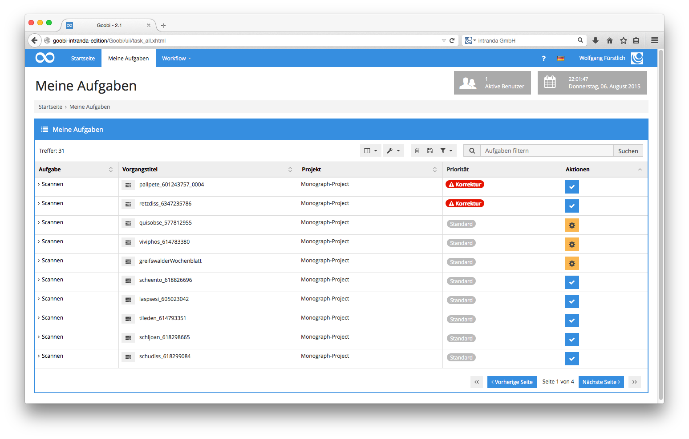
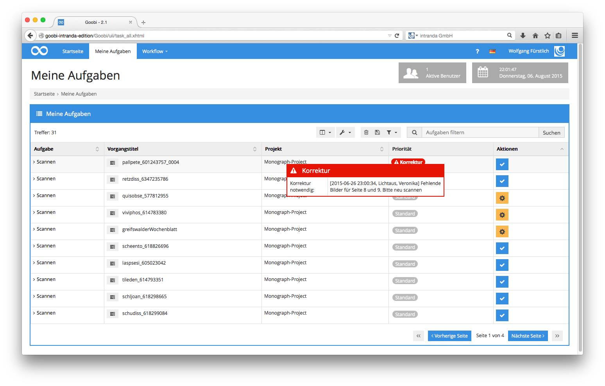
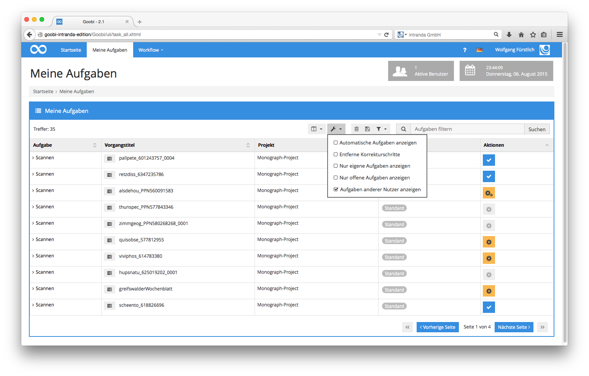
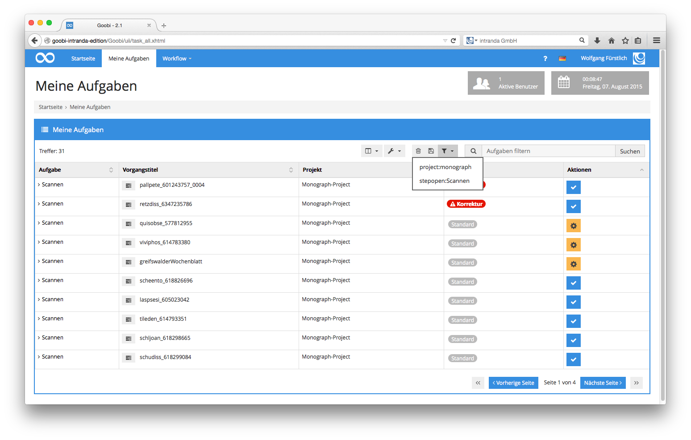
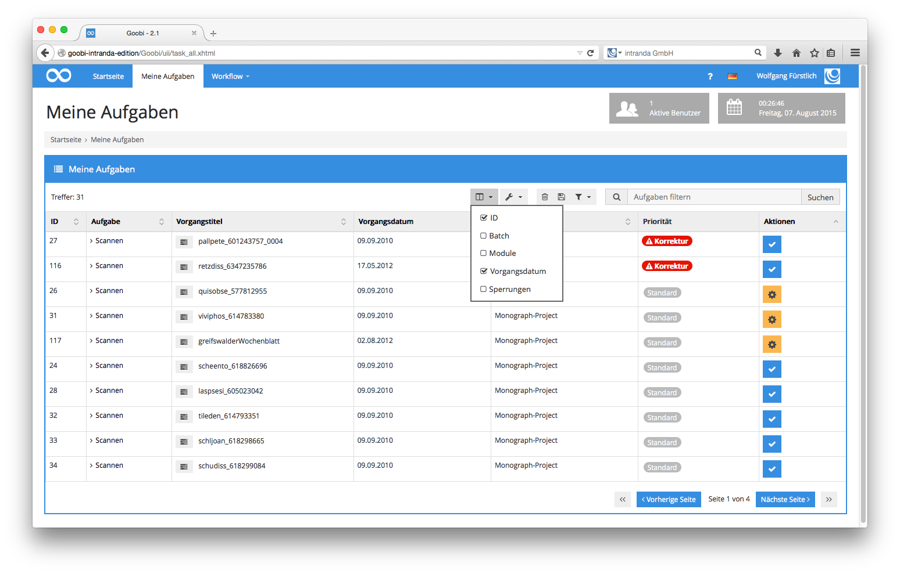

# 4.1.8.  My tasks

After logging in, most users continue with the menu option `My tasks` in the menu bar. This will display a screen similar to the one shown below:

In the `My tasks` list, you will only find those process tasks that form part of a project to which you have been assigned and which you are qualified to perform. In the diagram above, for example, a scan operator will only be shown tasks that are currently at the scanning stage of the overall workflow. The task name is shown in the `Task` column, while the name of the process to which the task belongs is shown in the `Process title` column.

The Project column displays the name of the corresponding project, and the `Priority` column provides a simple overview of the priority of the individual step. The priorities can be one of the following:

_**Explanation of the symbols for the priorities of a workflow step**_

| **Priorität** | **Bedeutung** |
| :--- | :--- |
|  | The task priority level is normal. |
|  | The task has priority and should therefore be given preference. |
|  | Die Aufgabe hat eine hohe Priorität und sollte eilig bearbeitet werden. |
|  | Die Aufgabe hat höchste Priorität und sollte dringend bearbeitet werden. |
|  | Zu dieser Aufgabe oder anderen Aufgaben innerhalb des Workflows dieses Vorgangs liegt mindestens eine Korrekturmeldung vor, so dass diese Aufgabe bevorzugt bearbeitet werden sollte. |

Depending on your configuration and the process involved, you will also find additional information next to the status symbol that tells you how urgent the task is. If you see a priority symbol, this means that the project manager has prioritised this step. Tasks will always be shown in priority order regardless of which column you have chosen as the basis for sorting and listing your tasks.

As well as these priority indicators, there is an option to send error messages back from a later to an earlier point in the workflow. This means that errors detected at a later stage can be redirected backwards along with an error report. A red `Correction` button with a warning symbol in the `My tasks` list will immediately show the responsible person that the task listed in that row is one that was previously completed but that has now been found to contain an error. To display the error message, hold the cursor briefly over the red Correction button.

The status of each task can also be identified from the icon displayed in the `Actions` column. Within the `My tasks` area, you will come across the following Action symbols:

_**Explanation of symbols used for indicating the status of a workflow step**_

| **Symbol** | **Meaning** |
| :--- | :--- |
|  | Diese Aufgabe befindet sich derzeitig noch nicht in Arbeit. Mit einem Klick auf dieses Icon übernehmen Sie diese Aufgabe. |
|  | Dieses Icon zeigt Ihnen an, dass diese Aufgabe bereits von Ihnen selbst bearbeitet wird. Ein Klick auf dieses Icon öffnet die Detailanzeige zu diesem Arbeitsschritt. |
|  | Dieses Icon zeigt Ihnen an, dass sich die zugehörige Aufgabe bereits in Bearbeitung durch einen anderen Benutzer befindet. Ein Klick auf das Icon öffnet die Details zu dieser Aufgabe. Eine Bearbeitung der Aufgabe ist durch Sie ohne vorherige Freischaltung durch den Goobi-Administrator nicht möglich. |
|  | Diese Aufgabe ist Teil eines Batches und kann durch Annahme zusammen mit anderen Aufgaben des gleichen Batches gemeinsam bearbeitet werden. |
|  | Dieses Icon zeigt, dass es sich bei dieser Aufgabe um eine Batch-Aufgabe handelt, die Sie bereits zur Bearbeitung übernommen haben. |
|  | Dieses Icon zeigt, dass es sich bei dieser Aufgabe um eine Batch-Aufgabe handelt, die bereits ein anderer Benutzer zur Bearbeitung übernommen hat. Ein Klick auf das Icon öffnet die Details zu dieser Aufgabe. Eine Bearbeitung der Aufgabe ist durch Sie ohne vorherige Freischaltung durch den Goobi-Administrator nicht möglich. |

If you wish to check the meaning of any of these symbols, simply hold the cursor over the symbol in question. In the `Actions` column, for example, this might show you which user is already working on that particular task.

If the number of hits is very large, you can choose to navigate between different pages of the table. To do this, click on the arrow symbols below the table to move forwards or backwards. If you click on the current page number for the table, this will display an input box where you can enter the number of the page you want to view. Once you confirm this with the `Enter` key, Goobi will take you directly to the page you requested.

There is some scope for changing the way the list of tasks is displayed under the heading `My tasks`. As a general rule, you can arrange the tasks in ascending or descending order for any of the columns. If too many tasks are displayed, you can use the menu options above the table to modify the display.

If you wish to modify the display, the following options are available:

_**Options for customising the My tasks list**_

| **Option** | **Notes** |
| :--- | :--- |
| Automatische Aufgaben anzeigen | Durch die Aktivierung dieser Option werden auch Aufgaben angezeigt, die automatisch ablaufen sollten und nicht manuell durch einen Nutzer ausgeführt werden müssen. |
| Entferne Korrekturschritte | Mit der Nutzung dieser Option werden all diejenigen Aufgaben aus der Tabelle ausgeblendet, zu denen eine Korrekturmeldung vorliegt. |
| Nur eigene Aufgaben anzeigen | Mit dieser Option werden ausschliesslich Aufgaben angezeigt, die durch Sie selbst bereits angenommen wurden und sich noch in Bearbeitung befinden. |
| Nur offene Aufgaben anzeigen | Mittels dieser Option werden nur diejenigen Aufgaben aufgeführt, die bisher nicht durch einen Benutzer angenommen wurden und sich daher auch noch nicht in Bearbeitung befinden. |
| Aufgaben anderer Nutzer anzeigen | Durch Aktivierung dieser Option lassen sich auch diejenigen Aufgaben anzeigen, für deren Ausführung Sie prinzipiell berechtigt wären, die allerdings bereits durch einen anderen Nutzer bearbeitet werden. |

As well as the check boxes that you can tick to restrict the range of tasks displayed, Goobi gives you the option to filter specific tasks from the overall list of those process tasks that have been assigned to your project team and that you are qualified to perform. To display only certain tasks, enter your filter term into the `Filter tasks` input box. You can find a description of possible filter terms in the section `Filtering processes`. You can also save your filters and make them available for all other Goobi users. 

This way, even complex filter terms can be selected and applied at any time from a list of previously saved terms. To save a filter and include it in the list of predefined filters, simply click on the save symbol after entering the term. You can then select and apply it any time you wish from the list.

If you want Goobi to display more columns in the `My tasks` list, you can choose from the following:

_**List of available columns that can be added to the task list**_

| **Column** | **Description of content** |
| :--- | :--- |
| ID | Anzeige der `ID` des Vorgangs für den jeweiligen Arbeitsschritt. |
| Vorgangsdatum | Die Spalte `Vorgangsdatum` listet Ihnen das Datum auf, an dem der Vorgang, zu dem der Arbeitsschritt gehört, in Goobi erzeugt wurde. |
| Modul | Anzeige der eingetragenen `Module` oder `Plug-Ins`, die zu dem jeweiligen Arbeitsschritt im Workflow festgelegt wurden. Diese Module oder Plug-Ins beinhalten zusätzliche Funktionalität, die den Funktionsumfang von Goobi für einen speziellen Arbeitsschritt erweitert. |
| Sperrungen | Die Spalte `Sperrungen`  listet Ihnen die Namen anderer Benutzer auf, die zu der jeweiligen Aufgabe gerade den Goobi-internen METS-Editor geöffnet haben. Die Bearbeitung der Struktur- und Metadaten im METS-Editor in Goobi erlaubt ausschließlich die Bearbeitung durch jeweils eine Person. Da für einzelne Projekte und Aufgaben je nach Standort und Konfiguration auch mehrere Personen zuständig sein können, ist mittels der Spalte `Sperrungen` ersichtlich, ob zur Zeit gegebenenfalls andere Mitarbeiter die Metadaten einzelner Vorgänge in Goobi exklusiv bearbeiten. |
| Batch | Die Spalte `Batch` führt die Batch-ID für den jeweiligen Vorgang auf. Ein Wert ist an dieser Stelle nur sichtbar, wenn sich der entsprechende Vorgang zusammen mit anderen Vorgängen in einem gemeinsamen Batch befindet und somit mehrere Vorgänge gleichzeitig bearbeitet werden sollen. |

To adjust the column display, just select the column that you wish to add to the table display. To do so, tick the corresponding checkbox.

