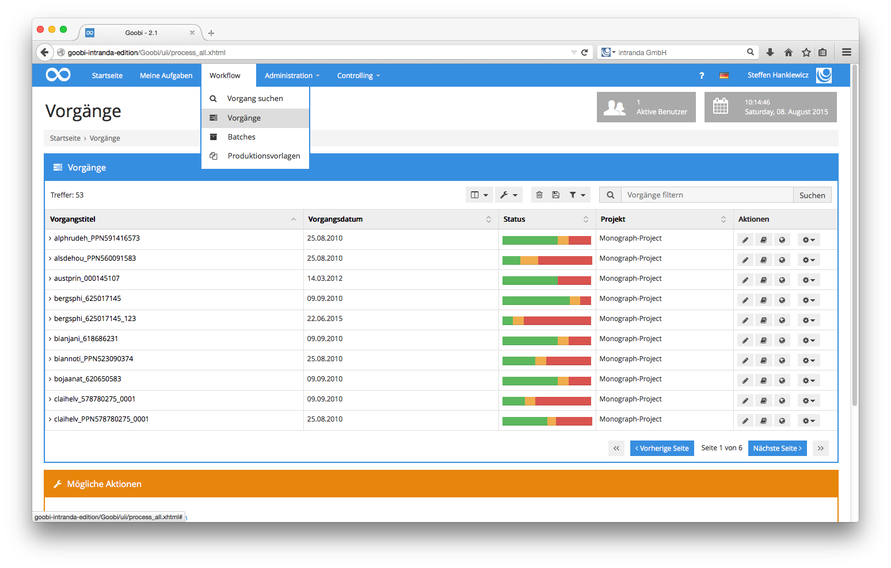

# 4.1.9. Processes

All the processes that you or other users create will remain in Goobi’s database. To display an overview of these processes, select the option `Workflow - Processes` in the menu bar.

Goobi will display a table of all the processes that you are allowed to access. This will depend on whether you are a member of those projects or an authorised Goobi administrator. These details are stored in your user account and will determine how much of the stored data will be displayed in the `Current processes` table. Equally \(unless you are an authorised administrator\), Goobi will not display processes belonging to projects that have been marked as completed by an administrator.

The process list gives you an overview of all those processes that have not yet completed all the corresponding steps. In addition to these active processes, if you wish to display processes that have completed all their steps, select the table menu option `Modify display` and check the `Show finished processes` box. This will display all the Goobi processes that you are authorised to access regardless of their current status. If you are a Goobi administrator, by ticking the checkbox `Show deactivated projects` you can also list those processes for which the overall project has already been marked as completed.

The overview of current processes allows you to work with specific processes and modify their data or the status of individual steps independently of the workflow. To do this, you do not yourself have to be a member of the user group that is registered in Goobi as the group with responsibility for the individual workflow steps making up the processes in the list. This means that you can, for example, access Goobi’s integrated METS Editor regardless of whether the status of the current process indicates that it is at the stage of obtaining and recording structure data and metadata. From this screen, you can also export the data to other systems, e.g. a presentation system for digitised material such as the intranda viewer. You can also, for example, generate PDF files from the digitised material in combination with the structure data and metadata that have been recorded.

Each of the columns in the process view table can be sorted into ascending or descending order by clicking on the column headings. The little sort direction symbols at the right-hand edge of the column heading cell will change accordingly.

The `Process title` column contains the unique identifier for each process. It is generated automatically from the metadata whenever new processes are added to Goobi.

The `Status` column shows you immediately how far a particular process has advanced in the workflow. The colour system used here indicates how many steps have already been completed out of the workflow by those users involved. The red section of the bar shows how many steps are still locked and cannot yet be processed by users. The yellow section shows how many steps are currently being processed or waiting to be processed. For details of the status of individual process steps, just click the process in the `Process title` column. Goobi will display a detailed list of all the steps for that process and their current status.

In the example above, you can see which individual steps out of the workflow have already been completed by users, which are currently being processed and which are still locked until the preceding steps have been completed. You can search for one or more specific processes from the list at any time using the `Filter processes` box. Your search term will need to be entered using the correct syntax. For more information, please see section `Filtering processes`.

A detailed description of all the functions provided by Goobi in process view can be found in the section `Goobi Management`, which contains further information about the functions described above and all other available options.

