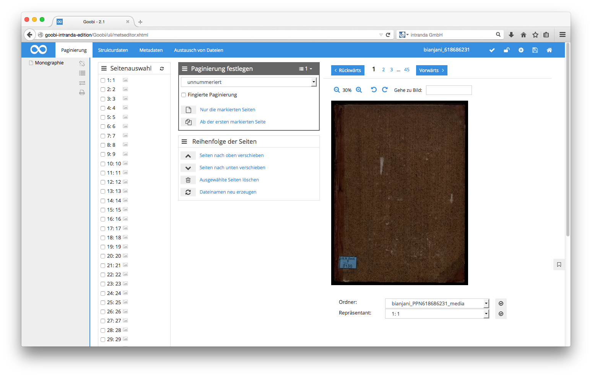
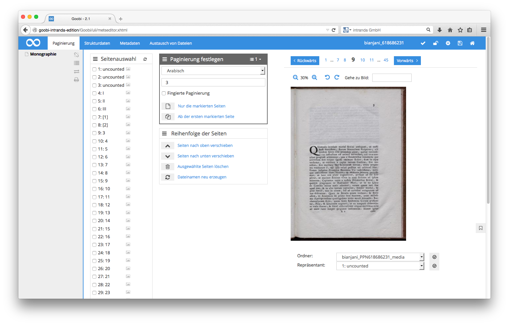

# 4.3.2.1. Paginierung

Bei der Paginierung handelt es sich um die Vergabe sogenannter `Page Labels` zu den Digitalisaten. Im Bereich der Digitalisierung ist die Paginierung dafür notwendig, dass einzelnen digitalisierten Seiten ihre aufgedruckte Seitennummer korrekt zugewiesen werden kann. Häufig wechseln gerade bei historischen Materialien die Seitenzählungen innerhalb eines Werkes. Oft fehlen aufgedruckte Seitenzahlen, Seitenzahlen wurden mehrfach vergeben oder die Paginierung wechselt im Werk mehrfach. Ein typisches Beispiel für eine solche wechselnde Paginierung ist beispielsweise, wenn der vordere Bereich eines Werkes mit römischen Seitenzahlen versehen ist und nach dem Inhaltsverzeichnis mit arabischen Seitenzahlen fortgesetzt wird.

Um die Paginierung für ein Werk zu bearbeiten, öffnen Sie im Metadateneditor mit einem Klick auf der Navigationsleiste den Bereich der Paginierung. Goobi ermittelt automatisch wie viele Bilder sich im Verzeichnis des aktuellen Vorgangs befinden und führt diese in einer Auflistung untereinander auf. Rechts daneben ist der Bereich, in dem die Paginierung für diese eingelesenen Images vergeben werden kann. Wie Sie in der Box `Seitenauswahl` sehen können, wurde durch Goobi zunächst festgelegt, dass alle Seiten fortlaufend arabisch nummeriert werden, beginnend bei der Zahl 1.

Navigieren Sie nun im rechten Bereich des Metadateneditors mittels der Tastenkombination oder der Bildernavigationsleiste durch das gesamte Imageset, um die aufgedruckte Paginierung der einzelnen Bilder zu ermitteln. In den meisten Fällen beginnen Bücher mit unpaginierten Seiten. Klicken Sie daher in der Box `Seitenauswahl` auf die erste Checkbox für das Image 1. Wählen Sie anschließend in der Box `Paginierung festlegen` in der Auswahlliste `unnummeriert` und klicken anschließend auf den Link `Ab der ersten markierten Seite`. Somit haben Sie dem gesamten Werk von der ersten bis zur letzten Seite als Paginierung zugewiesen, dass auf keiner Seite eine Seitenzahl aufgedruckt ist. Navigieren Sie nun durch die Seiten, bis Sie zur ersten paginierten Seite kommen.


**Tipp:** Wenn Sie beim Navigieren durch die Bilder eine Seite ermittelt haben, auf der sich die Paginierung ändert, klicken Sie einfach auf das Bild. Dadurch wird automatisch in der Box `Seitenauswahl` die passende Checkbox ausgewählt. Durch das Drücken der Space-Taste auf der Tastatur wird diese Checkbox nun automatisch gesetzt. Alternativ können Sie natürlich auch das passende Bild in der Liste `Seitenauswahl` ermitteln und mit der Maus auswählen.


Bitte beachten Sie, dass Sie sich für die Auswahl der Seiten stets an der Bildnummer orientieren und nicht an der aufgedruckten Seitennummer. Sie erkennen die Bildnummer daran, dass in Goobi zu jedem Bild stets zwei Bezeichnungen angezeigt werden: Links wird die Nummer der Datei innerhalb des Dateisystems angezeigt, die sogenannte Bildnummer. Gefolgt von einem Doppelpunkt wird rechts die aufgedruckte Seitenzahl angezeigt, das sogenannte Pagelabel. Orientieren Sie sich bitte immer an der Bildnummer - also der Zahl links vom Doppelpunkt - um eine versehentliche Auswahl falscher Seiten zu vermeiden, schließlich kann eine aufgedruckte Seitenzahl \(das Pagelabel\) in einem Werk mehrfach vergeben worden sein.

Nachdem Sie diejenige Seite ermittelt haben, ab der sich die Paginierung innerhalb des Werkes ändert, und die Checkbox dieser Seite markiert haben, wählen Sie in der Box `Paginierung festlegen` den gewünschten Paginierungstyp. Tragen Sie anschließend die aktuelle Seitenzahl \(bzw. Seitenbenennung\) ein und klicken erneut auf den Link `Ab der ersten markierten Seite`. Somit vergibt Goobi sämtlichen Images ab der gewählten Seite die gewünschte Seitenzahl fortlaufend hochgezählt.

Die Paginierung kann sich unter Umständen mehrfach im Werk ändern. Häufig sind ebenfalls ungezählte Seiten oder doppelte vergebene Seitenzahlen anzutreffen. Seiten, auf denen ein neues Strukturelement beginnt, wie z. B. ein neues Kapitel, auf dem jedoch keine Seitenzahl aufgedruckt ist, auf den Folgeseiten jedoch mit der Seitenzahl fortgesetzt wird, werden mit einer fingierten Paginierung versehen. Eine fingierte Paginierung ist daran zu erkennen, dass trotz fehlender Seitenzahl eine logische Zählung angenommen wird und daher die angenommene Seitenzahl mit eckigen Klammern versehen wird.


**Beispiel:** Fängt beispielsweise auf einer Seite ohne aufgedruckte Seitenzahl ein Kapitel an, und auf der folgenden Seite ist als Seitenzahl eine `4` aufgedruckt, so vergibt man während des Arbeitsschritts der Paginierung für die Startseite des Kapitels eine sogenannte fingierte Seitenzahl. In diesem Fall würde man der Startseite des Kapitels eine fingierte - also angenommene - Seite 3 zuweisen. Fingierte Seitenzahlen basieren entsprechend auf einer Interpretation, die aus der fehlenden Seitenbenennung und den vorhandenen Seitenbenennungen der Folgeseiten abgeleitet wird. Fingierte Seitenzahlen werden in eckigen Klammern dargestellt. Für die Startseite des Kapitels aus diesem Beispiel würde man entsprechend `3` als Seitenbenennung zuweisen.


Für eine effiziente Paginierung nutzen Sie einfach die Tastenkombination, die im Abschnitt Seitenanzeige beschrieben wurde. Sie können insbesondere bei umfangreichen Werken, bei denen Sie nicht jede einzelne Seite prüfen können oder möchten, stichprobenartig sicherstellen, dass Ihre vergebene Paginierung tatsächlich übereinstimmt. In den meisten Fällen lassen sich Sprünge innerhalb der Paginierung relativ schnell herausfinden. Navigieren Sie dazu einfach mittels der Tastenkombinationen in 20er Schritten durch das Imageset und vergleichen Sie die ausgewählte Seite und deren aufgedruckte Seitenzahl mit denjenigen Paginierungen, die Sie durch die fortlaufende automatische Vergabe zugewiesen haben. Sprünge in der Paginierung erkennen Sie daran, dass die vergebene Paginierung nicht mehr synchron zu der tatsächlichen gedruckten Paginierung verläuft.

Alternativ können Sie auch jederzeit neben einer Seite innerhalb der Box Seitenauswahl auf das Icon zur Anzeige der gewünschten Seite anklicken. Unmittelbar darauf wird das zugehörige Bild im rechten Bereich angezeigt.

| Icon | Beschreibung |
| :--- | :--- |
|  | Bild der gewählten Seite direkt anzeigen |

Goobi unterstützt für die Paginierung verschiedene Arten von Seitenzählungen. Neben der Vergabe von arabischen und fingierten arabischen Seitenzahlen, römischen und fingierten römischen Seitenzahlen, Freitexteingaben sowie unnummerierten Seiten, kann außerdem die Abfolge der fortlaufenden Zählung in Goobi beeinflusst werden. Innerhalb des Menüs der Box Paginierung festlegen lässt sich in Goobi festlegen, wie die Seitenabfolge im Buch tatsächlich auszusehen hat.

| Icon | Bechreibung |
| :--- | :--- |
|  | Festlegung des Paginierungstyps |

Folgende Seitenfolgen werden durch Goobi unterstützt:

_**Paginierungstypen des Metadateneditors**_

| **Paginierungstyp** | **Beschreibung des Paginierungstyps** |
| :--- | :--- |
| Seitenzählung | Auf jeder einzelnen Seite ist eine Seitenzahl abgedruckt. |
| Spaltenzählung | Auf jeder einzelnen Seite sind jeweils zwei Spalten vorhanden, die einzeln nummeriert sind. Die Zählung vergibt daher pro Seite zwei Seitenzahlen. Innerhalb der Box `Seitenauswahl` wird dies daran ersichtlich, dass bei fortlaufender Zählung zwischen den Seiten jeweils Sprünge von zwei Seitenzahlen existieren, da auf jeder einzelnen Seite jede Spalte eine Spaltennummer bekommt. |
| Blattzählung | Die Blattzählung kennzeichnet sich dadurch, dass jedes eingebundene Blatt innerhalb eines Buches eine Blattnummer erhält. Im Gegensatz zur Seitenzahl wird hierbei also nicht zwischen der Vorder- und Rückseite unterschieden. Die durch Goobi vergebenen Seitenzahlen werden bei der Auswahl dieser Zählvariante also nicht mehr pro Bild vergeben. Stattdessen erfolgt ein Wechsel für das automatische Hochzählen der Seitennummern jeweils erst für jedes zweite Bild. Entsprechend werden jeder vergebenen Seitenzahl jeweils zwei Bilder zugewiesen bevor die nächstgrößere Seitenzahl bzw. Blattzahl vergeben wird. |
| Blattzählung recto/verso | Mit der Blattzählung recto/verso erfolgt die Vergabe der Seiten in gleicher Weise wie bei der Blattzählung. Im Gegensatz zu dieser wird jedoch hinten an die Seitenzahl noch ein r für recto oder v für verso angefügt. |
| Seitenzählung recto/verso | Bei der Seitenzählung recto/verso wird wie bei der Seitenzählung verfahren. Auch hier wird hinten an die Seitennummer ein `r` für recto oder ein `v` für verso angefügt. |


**Tipp:** Möchten Sie innerhalb einer bestehenden Paginierungssequenz eine Änderung vornehmen, so können Sie auch eine Funktion in Goobi nutzen, die nicht automatisch sämtliche nachfolgenden Seiten durch eine automatische Zählung überschreibt. Wählen Sie hierfür einfach eine oder mehrere Seiten in der Box `Seitenauswahl` aus, vergeben anschließend die gewünschte Zählungs- und Paginierungsart und klicken dann auf den Link `Nur die markierten Seiten`. In diesem Fall erfolgt eine Änderung der Paginierung ausschließlich für diejenigen Seiten, die zuvor ausgewählt wurden.


