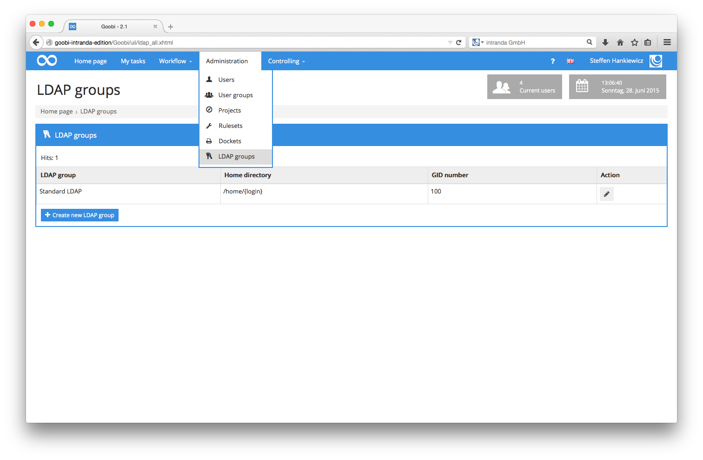
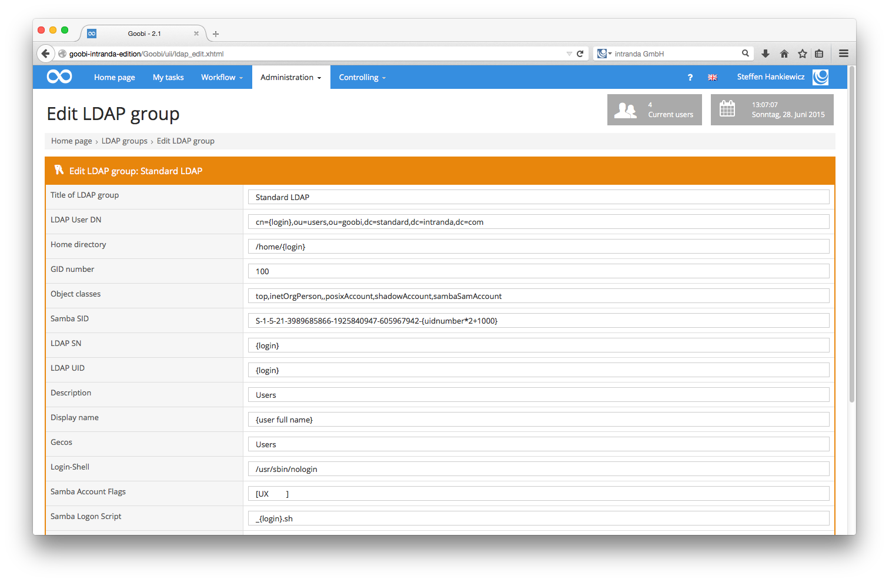

# 5.3. LDAP groups

One of Goobi’s key features is the integration of both Goobi and the additional services linked to it to a central authentication system. In most cases, the authentication process is conducted via a central LDAP server that allows users to work in different systems with a single user account and just one login and one password.

This means it is possible to log in to Goobi with your own user account and to access the work drive on which Goobi provides the data to be processed by users.

Access to the work drive is provided in the background via a Samba server that authenticates user requests via the central LDAP servers. To configure the LDAP groups, you need to click on the menu item `Administration - LDAP groups`. Goobi will display an overview of all the LDAP groups that have been set up. In most cases, only one LDAP group will be configured.

Klicken Sie auf das Icon zur Bearbeitung einer der konfigurierten LDAP-Gruppen, so gelangen Sie in die Bearbeitungsmaske. Innerhalb dieser können Sie die einzelnen Parameter für die LDAP- Authentifizierung konfigurieren.

| Icon | Description |
| :--- | :--- |
|  | Create new LDAP group |
|  | Edit existing LDAP group |


**Tip:** You must take great care and consult with the system administrator before making any changes to the data provided. If Goobi is configured incorrectly at this point, you could prevent all other users from using the program. Please feel free to contact intranda’s support team if you wish to reconfigure the LDAP groups but are not sure which parameters to use.


After changing the LDAP group parameters, click on the `Save` button to return to the list of LDAP groups and apply your changes. Clicking on the `Delete` button will delete the selected LDAP group permanently from Goobi. You should note that users will then no longer be able to access the authentication function. It is not possible to continue working with Goobi if an LDAP group has been incorrectly configured or deleted.

