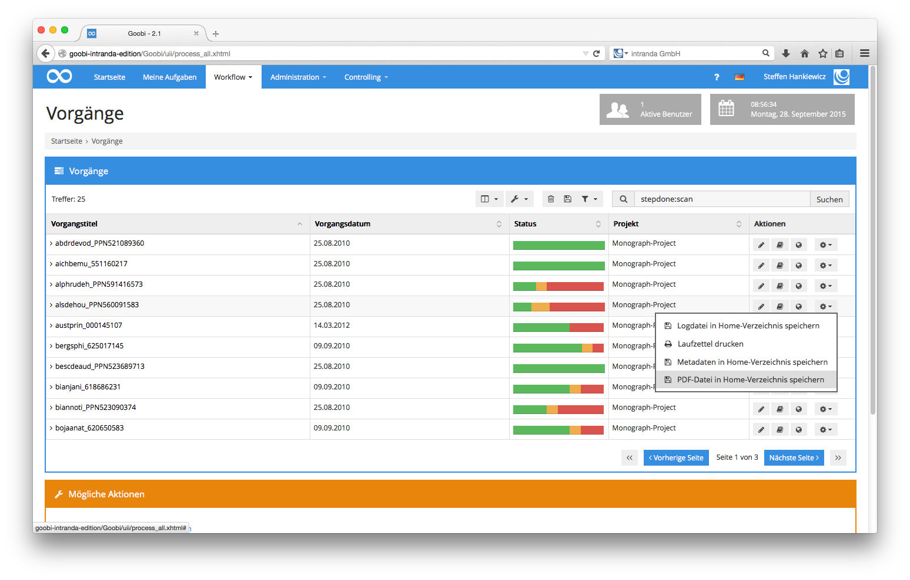

# 5.6.2. Aktionen

Möchten Sie noch detailliertere Informationen zu einem einzelnen Vorgang erhalten, so klicken Sie hierfür in der tabellarischen Auflistung auf das erste Icon `Vorgang bearbeiten` des gewünschten Vorgangs in der Spalte `Aktionen`. Dadurch öffnet sich die Detailansicht für den einzelnen gewählten Vorgang, und Sie können diesen gezielt bearbeiten. Neben der Bearbeitungsmöglichkeit jedes einzelnen Vorgangs, haben Sie ebenfalls die Möglichkeit, weitere Aktionen für jeden einzelnen Vorgang auszuführen. Zum Teil sind manche Symbole für einzelne Vorgänge gegebenenfalls noch deaktiviert, da sich der Vorgang noch nicht in einem Status befindet, der die jeweilige Aktion bereits erlaubt. So ist beispielsweise eine PDF-Generierung zu einem Vorgang noch nicht möglich, wenn zu diesem bisher noch keine Bilder vorliegen. Entsprechend ist das Symbol zur PDF-Generierung deaktiviert.

Folgende Möglichkeiten bieten sich für jeden einzelnen Vorgang in der Spalte der Aktionen:

_**Mögliche Aktionen für einzelne Vorgänge**_

| **Icon** | **Beschreibung der Aktion zu dem gewählten Vorgang** |
| :--- | :--- |
|  | Vorgang im Detail öffnen und bezüglich seiner Arbeitsschritte, physischen Vorlage, Werkstück und den zugehörigen Eigenschaften bearbeiten. |
|  | Öffnen des METS-Editors für den gewählten Vorgang, um Änderungen an den Struktur- und Metadaten sowie der Paginierung vornehmen zu können. |
|  | Erzeugung einer Verlinkung innerhalb des Arbeitsverzeichnisses des aktuellen Benutzers. Hierbei wird für den gewählten Vorgang innerhalb des eigenen Benutzerverzeichnisses eine Verlinkung erzeugt, die einen Zugriff auf die Bilder des gewählten Vorgangs gewährt. Somit ist es für einen Administrator möglich, jederzeit unabhängig vom derzeitigen Status des Vorgangs Zugriff auf die zugehörigen Dateien des Vorgangs zu erhalten, um diese beispielsweise prüfen oder verändern zu können. |
|  | Verlinkung aus dem Homeverzeichnis entfernen: Nach Abschluss der Bearbeitung oder Einsichtnahme in die Daten eines Vorgangs kann über dieses Symbol die Verlinkung aus dem Arbeitsverzeichnis des Benutzers wieder entfernt werden, so dass kein weiterer Zugriff mehr auf die Daten des Vorgangs besteht. |
|  | Generierung eines Laufzettels: Eine Laufzettelgenerierung erfolgt bereits zum Zeitpunkt des Anlegens eines Vorgangs. Für den Fall, dass zu einem späteren Zeitpunkt ein solcher Laufzettel noch einmal erzeugt werden soll, besteht hier die Möglichkeit, diesen jederzeit neu generieren zu lassen. Nach dem Klick auf dieses Symbol wird von Goobi eine PDF-Datei zum Download angeboten, die sich anschließend ausdrucken und für beliebige Zwecke verwenden lässt. |
|  | Generierung der METS-Datei: Generierung der METS-Datei: Soll außerhalb des regulären Workflows für den gewünschten Vorgang eine vollständige METS-Datei generiert werden, so bietet Goobi hierfür die Möglichkeit. Nach dem Klick auf das Symbol wird entsprechend innerhalb des Arbeitsverzeichnisses des Benutzers diese METS-Datei erzeugt und gespeichert. |
|  | PDF-Generierung: Soll zu einem einzelnen Vorgang eine PDF-Datei erzeugt werden, so haben Sie an dieser Stelle die Möglichkeit dafür. Je nach Konfiguration von Goobi wird diese PDF-Datei entweder direkt in Ihrem Arbeitsverzeichnis abgelegt oder zum Download angeboten. Eine in diesem Kontext generierte PDF-Datei enthält je nach Status des Vorgangs entweder nur die Bilder, die in dem Vorgang eingespielt wurden oder auch bereits Strukturinformationen. Wurden Struktur- und Metadaten innerhalb des METS-Editors für diesen Vorgang bereits erfasst, so werden diese entsprechend in der PDF-Generierung berücksichtigt. Die anschließend generierte PDF-Datei ist dann mit einem verlinkten Inhaltsverzeichnis versehen. |
|  | Export in das Dokumenten-Management-System: Soll unabhängig vom Workflow-Status ein einzelner Band ein erneutes Mal in das konfigurierte Präsentationssystem exportiert werden, so haben Sie über dieses Symbol hierfür die Möglichkeit, so dass ein Export für einen einzelnen Vorgang gezielt und unabhängig vom Workflowstatus ausgeführt werden kann. Hierbei werden die zugeordneten digitalen Objekte \(zumeist Images\) sowie die METS-Datei in ein innerhalb des Projektes definiertes Verzeichnis exportiert, das für die Übergabe an das Präsentationssystem zuständig ist. Nach erfolgreichem Export erscheint eine Erfolgs- bzw. im Falle eines Fehlers eine Fehlermeldung, die über den Status des Exports Auskunft gibt |

Bitte beachten Sie, dass sämtliche der hier angebotenen Aktionsmöglichkeiten für einzelne oder auch mehrere Vorgänge zusammen unabhängig davon ausgeführt werden können, in welchem Status sich der einzelne Vorgang gerade befindet. Für Benutzer von Goobi mit Projektleitungs- oder administrativen Berechtigungen besteht somit jederzeit die Möglichkeit, gezielt einen Eingriff in die Daten einzelner Vorgänge zu nehmen und gegebenenfalls Daten zu verändern.

