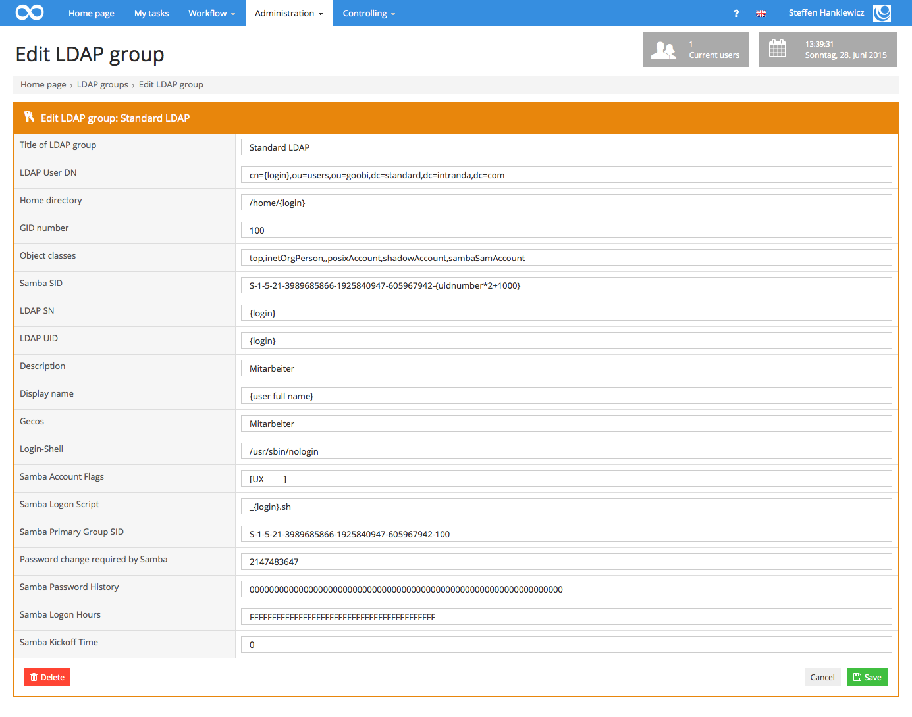

# 3.3. User authentication using LDAP

## **General**

In general, Goobi uses an LDAP server to authenticate users. This makes it possible to connect to the assigned network drive using the same login and password as for Goobi. The LDAP connection is configured in the Goobi configuration file goobi\_config.properties. As before, LDAP groups are set up by Goobi in the Administrator area.

The LDAP server needs to include the following schemas: `COSINE`, `inetOrgPerson`, `NIS` und `SAMBA`..

## **Configuring LDAP in the file goobi\_config.properties**

The following configuration settings are available in the file `goobi_config.properties`:

_**List of parameters for configuring access to the LDAP server**_

| **Option** | **Explanation** |
| :--- | :--- |
| `ldap_use` | Using an LDAP server \(true/false\) |
| `ldap_use` | CA certificate for SSL connections |
| `ldap_cert_pdc` | Server certificate for SSL connections |
| `ldap_cert_pdc` | Path to assigned keystores |
| `ldap_keystore_password` | Password to keystores |
| `ldap_url` | URL of LDAP server |
| `ldap_readonly` | Read-only access to LDAP \(true/false\) |
| `ldap_encryption` | Encoding type for passwords \(SHA/MD5\) |
| `ldap_useTLS` | Encoding LDAP connection using TLS |
| `ldap_sslconnection` | Encoding LDAP connection using SSL |
| `ldap_nextFreeUnixId` | LDAP attribute giving next free UNIX user ID |
| `ldap_adminLogin` | DN for LDAP access |
| `ldap_adminPassword` | Password for LDAP access |
| `ldap_readDirectoryAnonymous` | Anonymous access to the LDAP |

If you are using a local LDAP server, it can be configured as follows in the configuration file `goobi_config.properties`:

```text
# -----------------------------------
# LDAP Configuration
# -----------------------------------

# Logins ueber LDAP verwenden
ldap_use=true

# Root-Certificate
ldap_cert_root=/opt/digiverso/goobi/scripts/cacert.crt
ldap_cert_pdc=/opt/digiverso/goobi/scripts/cert.crt

# Keystore
ldap_keystore_password=changeit
ldap_keystore=/opt/digiverso/goobi/scripts/mykeystore.ks

# Zugriffsdaten fuer LDAP (Gleichheitszeichen maskieren)
ldap_url=ldap://localhost:389/
ldap_nextFreeUnixId=cn\=NextFreeUnixId,dc\=goobi,dc\=example,dc\=net
ldap_adminLogin=cn\=Manager,dc\=goobi,dc\=example,dc\=net
ldap_adminPassword=CHANGEME
ldap_sslconnection=false

# Password encryption SHA or MD5
ldap_encryption=SHA

ldap_readonly=true
ldap_useTLS=false
```

## **Configuration in Goobi**

As before, LDAP groups have to be configured in Goobi’s Administrator area. It is particularly important to set up the User DN correctly. This involves assigning Goobi users to a user defined in the LDAP. In this case, the variable `{login}` is replaced by the user name to be used for logging in.

Example configuration of an LDAP group in Goobi:



## **Configuration within the operating system**

As well as these Goobi-specific settings, it is important to ensure that LDAP users are identified to the operating system. The LDAP information must be entered correctly. This is particularly important for the following files:

```bash
/etc/ldap/ldap.conf
/etc/ldap.conf
/etc/nsswitch.conf
/etc/pam.d/*
```

In the case of SAMBA, the use of an LDAP server has to be activated. If you are using Ubuntu 14.04 LTS, it is activated by default.

