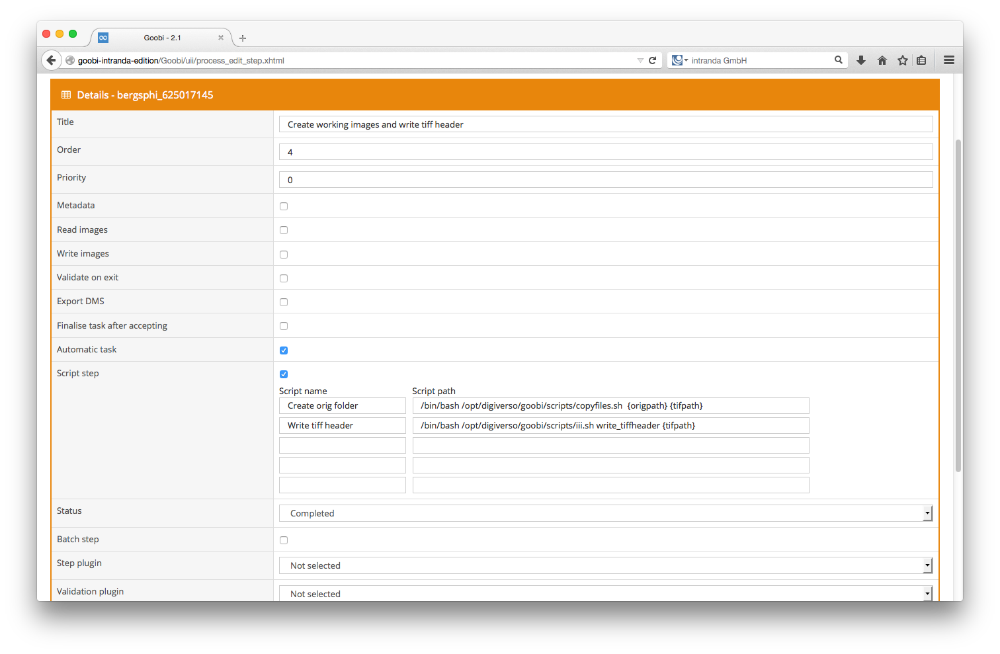

# 6.1. Example combination for an automatic script task

In most cases, an automatic task is combined with a script task. Goobi then responds to the script output. Goobi will treat any messages issued on the default output console as simple status reports and will continue operation. However, Goobi will treat any messages issued on the error output console as errors and will interrupt workflow processing.



One example for the combination of an automatic workflow task and a script task is the conversion of images to `TIFF/JPEG`. Goobi automatically calls a script and converts the images in the specified folder to `TIFF/JPEG` format.

The following example shows how Goobi calls a script for the intranda image improver:

```bash
/opt/digiverso/goobi/scripts/iii.sh
```

The call involves providing two parameters. The first of these, `convert_images`, is defined in the script itself. Goobi replaces the other parameter `{tifpath}` dynamically by the path to the folder in which the image set is located.


Parameters can be combined with quotation marks \(`"`\) to pass them as an argument to the called process. If a quotation mark is to be passed directly to the new process as an argument, it must be escaped with a preceding second quotation mark \(then: `""`\).


