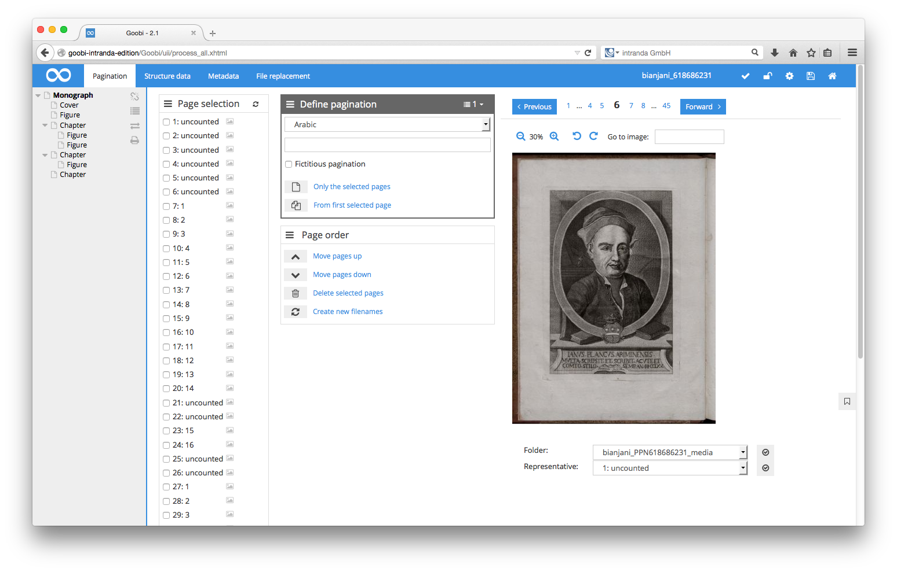
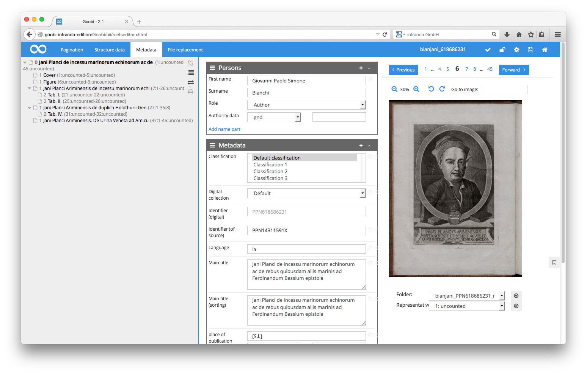

# 4.1.3. Menu options

Goobi offers a wide range of functions that simplify the task of working with structure data and metadata. These options can be found in the top menu bar and at the right-hand edge of the structure tree pane in the Metadata Editor.

## Functions in the top menu bar

The following functions are available from the top menu bar. The corresponding icons can be found on the right-hand side of the bar.

### Validation

At any time while you are working with the Metadata Editor, you can use the `Validate` option to check whether you have complied with the rules provided by Goobi for the structure data and metadata. These rules are defined individually for each project by the Goobi administrator. Before closing the step you are working on, Goobi will conduct a further validation check. If this validation fails, Goobi will not let you close the task. It is therefore advisable to perform regular validation checks in the Metadata Editor to ensure that you have complied with the rules. If you click `Validate` and Goobi then determines that your metadata and structure data do not comply with the established rules, it will display an explanatory warning message to that effect.

| Icon | Description |
| :--- | :--- |
|  | Validate metadata against designated ruleset |

### Fixed image

By choosing this function you can prevent the image from scrolling in the Metadata Editor when you are dealing with long lists of metadata or during the allocation of pagination sequences. If you activate this function, the selected image will remain in place on the right hand side of the window together with its navigation bar and the zoom options, even if you scroll up or down on the right of the Metadata Editor.

| Icon | Description |
| :--- | :--- |
|  | Fix the image display to avoid image scrolling |

### Settings

This menu bar icon provides several options for additional settings. Simply click the icon to display the available functions.

| Icon | Description |
| :--- | :--- |
|  | This menu bar icon allows you to choose various settings from a sub-menu. |

### Save

The `Save` option allows you to save your work in the Metadata Editor at any time. You should always click on this button when you want to make sure your data cannot be lost.

| Icon | Description |
| :--- | :--- |
|  | Save the current structure data and metadata |

### Exit the METS Editor

Click this menu bar icon to exit the METS Editor. You then have two options.

The `Exit` option exits the Metadata Editor without saving your work, so you should usually ensure that you save your data before selecting this option. This function can also be used, for example, to exit the Metadata Editor without having to save your work in the event that you unintentionally delete or change the data.

The option `Save and exit` saves all your work and closes the Metadata Editor. Goobi will then return you to the screen from which you launched the Metadata Editor. If you accessed the Metadata Editor from My tasks, for example, you will find yourself back in that area. If you launched the Metadata Editor from the Processes area, selecting Save and exit will automatically return you to the same point in that area.

| Icon | Description |
| :--- | :--- |
|  | Verlassen des METS-Editors mit oder ohne vorheriges Speichern |

## Additional settings

If you select the menu bar icon Settings, Goobi will display a drop-down list containing several additional functions.

### Display the hierarchical level in the structure hierarchy

Click on this function to display information about the hierarchical level of each structure element in the structure tree on the left. This function is particularly useful in cases where the hierarchy of the structure tree contains many levels. An indication of the hierarchical level can help you determine which level you are currently viewing.

| Icon | Description |
| :--- | :--- |
|  | Display the hierarchical level in the structure hierarchy |

### Fully collapse the structural hierarchy

Using this function, you can switch between the fully expanded and fully compressed versions of the structure tree on the left hand side of the Metadata Editor. This allows you to fully expand even the most complex structure trees with a single click without having to click and expand each section within the tree individually.

| Icon | Description |
| :--- | :--- |
|  | Fully collapse the structural hierarchy |

### Hide image / Show image

You can select the `Hide image` option at any time to prevent the image from being displayed. Conversely, the `Show image` option causes the image to be shown again after being hidden.

| Icon | Description |
| :--- | :--- |
|  | Hide image / Show image |

### Reset pagination completely

This option allows you to recommence pagination. You may wish to use this function to reset all the pagination data and start indexing the pagination sequences again from the beginning.

| Icon | Description |
| :--- | :--- |
|  | Reset pagination completely |

### Show physical structure tree / Show logical structure tree

This function allows you to work with the physical structure tree rather than the logical structure tree. This allows you, for example, to record metadata for individual pages or edit metadata stored in the physical metadata area.

| Icon | Description |
| :--- | :--- |
|  | Show physical structure tree / Show logical structure tree |

## Functions available at right-hand edge of the structure tree pane

The structure tree pane contains a number of additional icons/functions that can be used to modify the way the structure tree is displayed.

### Link the image with the selected structure element

The function gives you an option to link the structure tree on the left of the Metadata Editor to the image. If this function has been activated, the image display will change to the start page of the structure element you have selected in the structure tree.

| Icon | Description |
| :--- | :--- |
|  | Link the image with the selected structure element |

### Show main title in the structural hierarchy

If you activate this function, Goobi will display the names given to individual structure elements directly within the structure tree. This may give you a better overview, e.g. to help you locate chapters by their name in the structure tree.

| Icon | Description |
| :--- | :--- |
|  | Show main title in the structural hierarchy |

### Display the assigned pages in the structure hierarchy

Select the `Tree page number` to display the page ranges allocated to each structure element in the structure tree on the left. The first and last page of the range will appear in brackets next to each structure element. Each page range displayed contains the image number and the page label \(printed page number\).

| Icon | Description |
| :--- | :--- |
|  | Display the assigned pages in the structure hierarchy |

### Print this page

Select this icon if you wish to print out the structure tree.

| Icon | Description |
| :--- | :--- |
|  | Print the structure element hierarchy |

