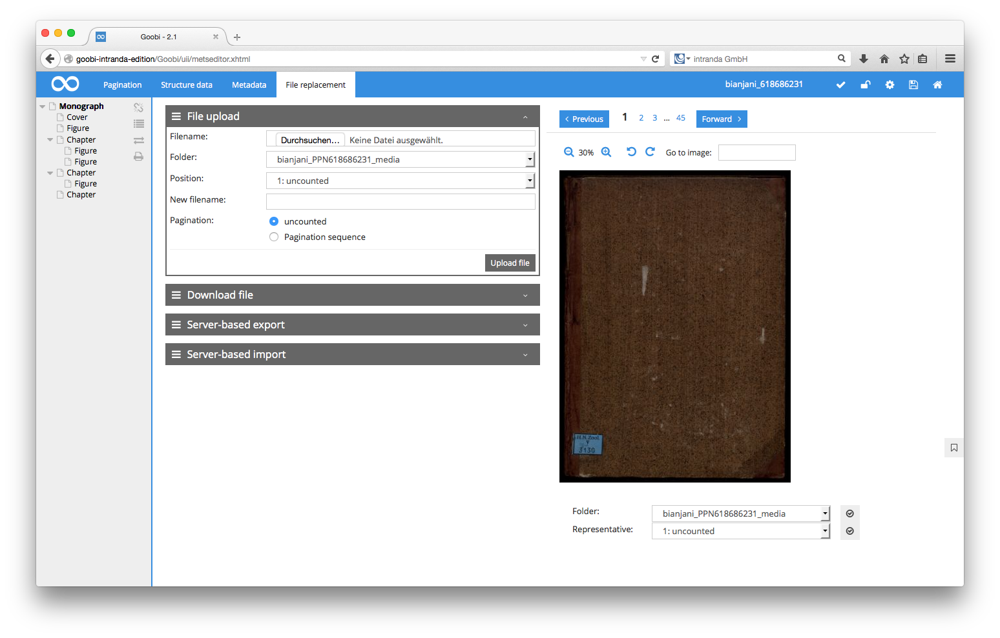

# 4.3.2. Uploading files

This function can be used to upload a file from the user’s computer to a selected process folder.

The user will need to specify a file and choose the position within the pagination sequence where the new file is to be inserted. Next the user can choose whether this new file is to be inserted as an `uncounted` page or whether it should be integrated into the existing pagination. Click the `Upload file` button to insert the file into the currently selected process folder. If this is the media folder, the pagination sequence will be updated. The file will be inserted in the selected position and either created as a uncounted page or integrated into the existing pagination sequence. If the file is integrated, the page number for each of the following pages will increase by one. In this context, however, it is important to note that the last file in the pagination sequence is not allocated a page number. It remains unpaginated and if necessary will again have to be changed separately in the pagination sequence.

If there is already a file in the selected folder with same name as the file being updated, the file cannot be uploaded and the user will receive an error message.

